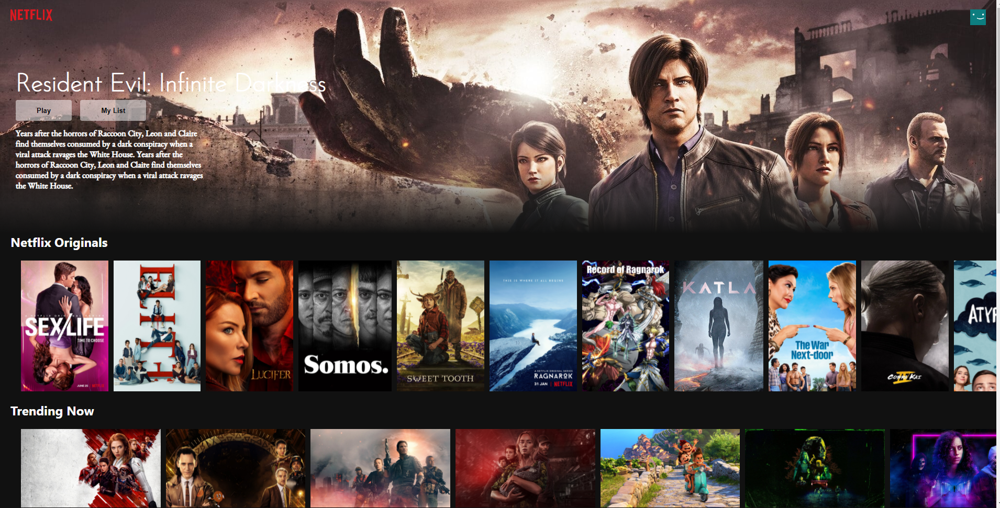
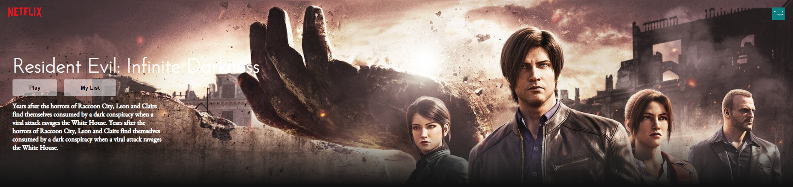
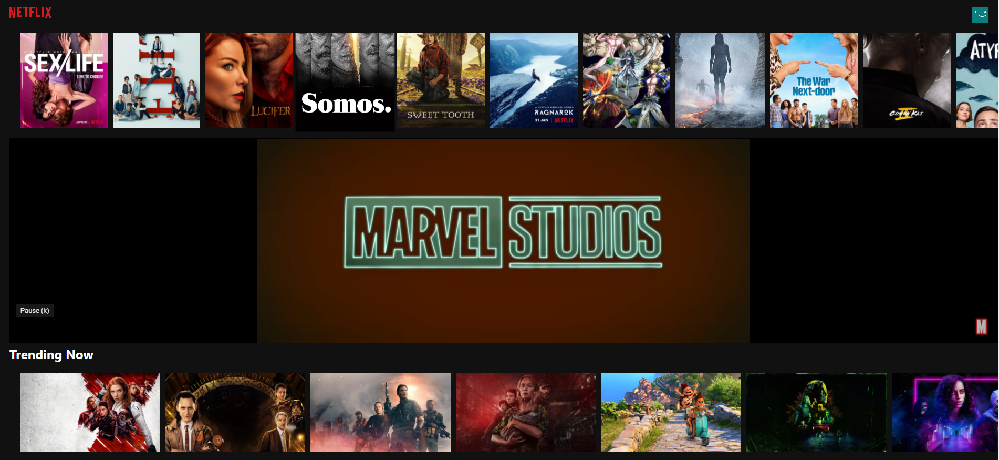

<h1 align="center">
  
   
  Netflix Clone Built Using React.JS & Firebase
</h1>

  This is a Netflix clone website built using <strong><em>React.JS</em></strong> as a Front-end & <strong><em>Firebase</em></strong> as Back-end. It's not a replica, and it     doesn't have all the features of Netflix website. It's a similar version of Netflix with some of the features.This project is showing my abilities in React.JS to build something advanced like Netflix. It contains the home page, a random header, Youtube trailer player.
     
  <strong><em>Here is the live version:</em></strong> https://netflix-cl-c7b15.web.app/ 

 
# Home Page
  The Home Page Contains
  
  ***1-Header***
  ***2-Movie Description***
  ***3-Movie Categories***
  ***4-Yotube Trailers***
  
 

# Header

The Header has a banner that changes every time user refreshes. Background image and movie description is changing based on Netflix Original movies. All the data fetched from https://api.themoviedb.org/.

# Youtube Trailer

When you click on the movies in the home page categories, if that movie has a youtube trailer linked the Youtube player will show up.

